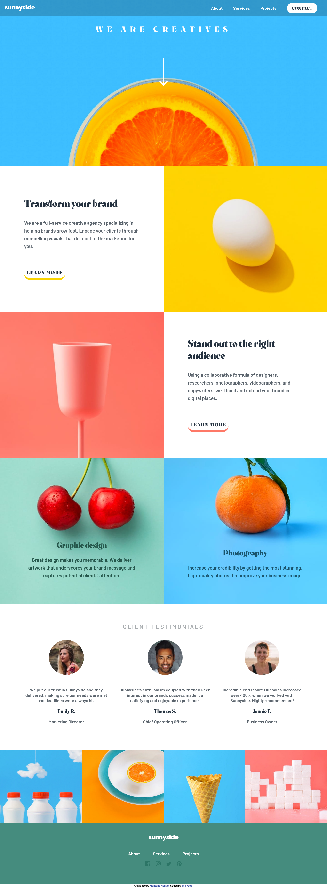

# Frontend Mentor - Sunnyside agency landing page solution

This is my solution to the [Sunnyside agency landing page challenge on Frontend Mentor](https://www.frontendmentor.io/challenges/sunnyside-agency-landing-page-7yVs3B6ef). Frontend Mentor challenges help you improve your coding skills by building realistic projects.

### Screenshot

### Links

- Solution URL: [Check solution](https://www.frontendmentor.io/challenges/sunnyside-agency-landing-page-7yVs3B6ef/hub/sunnyside-agency-landing-page-7E06SDEX1a)
- Live Site URL: [Visit live site](https://sunnysidetheface.netlify.app)

### Built with

- Semantic HTML5 markup
- CSS custom properties
- JavaScript

## Author

- Portfolio - [Ezekiel The Face](https://thefacecodes.web.app)
- Frontend Mentor - [@iamtheface](https://www.frontendmentor.io/profile/thefacecodes)
- Twitter - [@thefacecodes](https://www.twitter.com/thefacecodes)
